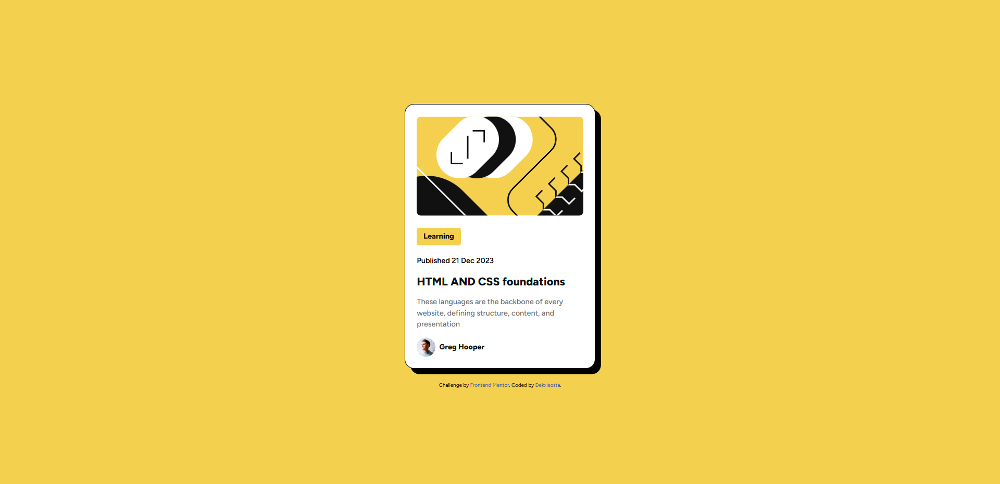

# Frontend Mentor - Blog preview card solution

## Overview
Users should be able to:
- See hover and focus states for all interactive elements on the page

### Screenshot

### Links
- [Frontend Mentor Solution](https://www.frontendmentor.io/solutions/blog-preview-card-using-html5-css3-and-flexbox-dQL1tCSihA)
- [Live Site](https://dekxisosta.github.io/blog-preview-card-challenge/)

### Built with
HTML5, CSS3, Flexbox

## Author
- Frontend Mentor - [@Dekxisosta](https://www.frontendmentor.io/profile/Dekxisosta)
